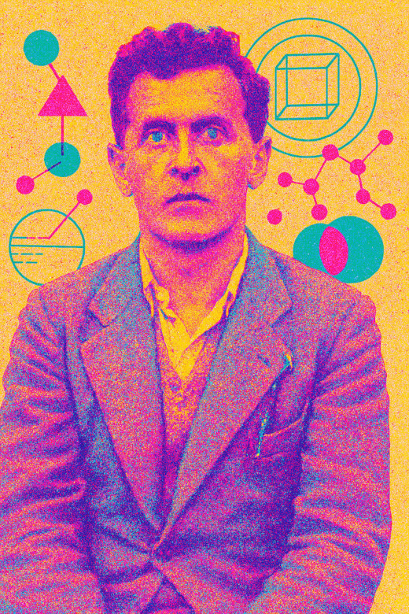
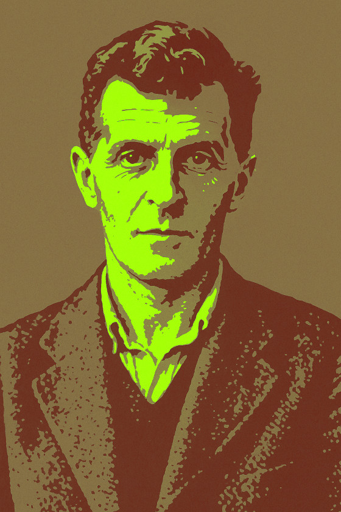

# Wittgenstein, The Programmers' Philosopher

In the realm of computer science and software engineering, philosophical underpinnings often go unacknowledged. Yet, the ideas of Ludwig Wittgenstein, one of the 20th century's most influential philosophers, offer surprising insights for modern programmers. Wittgenstein's evolution from rigid logical formalism to a more context-dependent view of language mirrors the journey many developers take throughout their careers—from seeking absolute, "correct" solutions to embracing the messy, contextual nature of real-world programming.

Wittgenstein's philosophical journey can be divided into two distinct periods, each with profound implications for how we might think about programming and artificial intelligence.

## Early Wittgenstein: **The Picture Theory of Language** and **Logical Atomism**

In his earlier work, particularly the *Tractatus Logico-Philosophicus* (1921), Wittgenstein proposed what came to be known as the "picture theory" of language. The theory posits that language functions primarily as a logical picture of reality—that the structure of a sentence mirrors the structure of the facts it describes.

For programmers, this perspective resonates with formal systems like strongly-typed languages, mathematical proofs, and the logical underpinnings of computation itself. Early programming paradigms and AI approaches embraced this formal logical view, assuming that:

1. Programming languages could be reduced to formal logical structures
2. Natural language could be parsed through rigid rule-based systems
3. Knowledge could be represented as formal logical statements

This approach influenced early computer science substantially, particularly in the realms of formal languages, compiler design, and first-generation AI systems. The appeal is clear — if language and reality share logical form, then programming languages could be designed to capture this form with precision and clarity. I sometimes feel like this idea is making a strong comeback in the functional programming circles through advocate of algebraic formalisms to interaction combinators.

When Wittgenstein posits that propositions mirror the world’s logical structure, acting as “pictures of facts”. Programs are nothing but executable propositions. Thus one could also say **Wittgenstein invented Domain-Driven Design**.

## Later Wittgenstein: **Language Games** and **Meaning as Use**

After a hiatus from philosophy — he actually had the gumption to think he solved the entirety of philosophy as a young arrogant prick — in *Philosophical Investigations*, he rejected the rigid picture theory in favor of a more practical, contextual understanding of language. Dude basically grew up and out of the academic ivory tower.

His new view argued that words gain meaning through their use in specific contexts or "language games"—practices embedded in particular forms of life. As he famously wrote, "the meaning of a word is its use in the language." Under this view, understanding language requires participation in shared practices rather than abstracting formal rules.

Wittgenstein’s concept of “family resemblances”, where overlapping traits define categories without a single essential feature—applies to software design, exemplifies this more clearly. Consider “games”: no universal rule defines all games, yet shared traits (e.g., goals, interaction) create a cohesive category. Similarly, design patterns like MVC (Model-View-Controller) vary across frameworks but share core principles. A web app’s MVC in React differs from a desktop app’s implementation, yet both retain a recognizable structural kinship.

I personally think shared context and language feeds into a recursive cycle where context not only shapes language and meaning. Language shapes thinking which begins the cycle anew — hopefully a positive and not a vicious one. "The limits of my language mean the limits of my world," Wittgenstein famously wrote in the *Tractatus*.

### The Programmer's **Ladder of Understanding**

Wittgenstein's famous ladder metaphor from the *Tractatus* suggests that once we've climbed to understanding, we can discard the ladder. For programmers, this might represent the journey from learning syntax and formal rules to developing an intuitive grasp of a language or system.

Consider a programmer's intellectual evolution:
1. Learning basic syntax and structure
2. Following tutorials and examples
3. Copying patterns — e.g. GoF
4. Gradually gaining expertise on a framework — e.g. Rails or Django guys
5. Eventually overcoming the need for the framework and complaining about it endlessly on twitter — e.g. every ORM that ever existed

This progression reflects Wittgenstein's insight that understanding is not just about knowing rules but about participating in a practice until it becomes part of you and you become part of it — cough cough, open source.

### Language Games in Software Development

Software development communities play distinct "language games" in Wittgenstein's sense. Consider the differences between:

- Front-end and back-end development cultures
- Functional programming versus object-oriented programming communities
- Academic computer science versus industry practices
- Different company engineering cultures (FAANG vs startups)

Each community develops its own vocabulary, values, and practices. The meaning of terms like "clean code," "scalable," or "maintainable" varies significantly across these contexts. A solution considered elegant in one community might be viewed as over-engineered or impractical in another.

Wittgenstein helps us understand why these differences arise and persist. They are not merely matters of preference but reflect different forms of life with distinct goals, constraints, and histories.

## AI, LLMs, and Wittgensteinian Insight

The recent success of large language models raises fascinating questions about Wittgenstein's notion that "meaning is use." These models produce seemingly meaningful output without traditional "understanding".

LLMs seem to validate Wittgenstein's later view that meaning emerges from patterns of use rather than from logical picture-relationships to reality. The models don't "understand" in a human sense, yet they produce text that humans recognize as meaningful.

Which implies a possible conclusion that maybe it's *us* who are just pattern-recognition machines and not *just* them. I think I agree with this to some degree. I should leave my thoughts on God and Chardin's Omega point for another article...

> Edit 2024: [Very interesting Stack Overflow rabbit hole that led me to these thoughts here.](https://philosophy.stackexchange.com/questions/112021/does-the-success-of-ai-large-language-models-support-wittgensteins-position-t)

## Practical Wittgensteinian Advice for Programmers

Drawing from Wittgenstein's insights, programmers might consider these principles:

1. **Embrace Context**: Recognize that programming solutions are always embedded in particular contexts and practices. Wittgenstein gave us one of the best examples of academic maturity, left the ivory tower and recognized his early arrogance, you should too.

2. **Prioritize Clarity over Abstraction**: Rather than pursuing theoretical elegance, focus on code that clearly communicates intent within your team's shared understanding.

3. **Learn by participation and respect the Ecosystem and its History**: To truly understand a codebase or technology, participate in its community and practices. Actually learn a couple of frameworks and OOP before talking shit on them. There's a lot to talk shit about but it's better if you know what you're talking about. It's absolutely not the meaning he intended 😅, but I could not end a Wittgenstein article without this quote: "whereof one cannot speak, one must remain silent".

> The fuller context for the quote is: "What can be said can be said clearly; whereof one cannot speak, one must remain silent". This is about the Picture Theory of the Language and he's advocating for program correctness, functional programming, and the Berkeley as opposed to the New Jersey school of thought as Richard Gabriel would put it 🤪 — look up "Worse is Better".

## Conclusion

Wittgenstein's philosophical journey from logical formalism to contextual pragmatism offers a powerful framework for thinking about software development. As programmers, we often begin with a desire for logical purity and formal correctness, only to discover that real-world programming is embedded in social practices, evolving contexts, and specific purposes.

By recognizing programming as a collection of language games rather than a single formal system, we can approach our craft with greater humility, flexibility, and effectiveness. Wittgenstein teaches us that meaning emerges not from abstract definitions but from concrete use—a lesson as valuable in writing code as it is in natural language.

In an age where AI systems like large language models both validate and challenge Wittgenstein's insights, his philosophy might give us insight into whether it's "machines that also think" or "humans that just process". Perhaps we might say that to be a good programmer is not to know all the rules, but to play the code game well.

# References

- [Wittgenstein Explains Why We Always Misunderstand One Another on the Internet](https://slate.com/human-interest/2015/09/take-a-wittgenstein-class-he-explains-the-problems-of-translating-language-computer-science-and-artificial-intelligence.html)
- [Does the success of AI (Large Language Models) support Wittgenstein's position that "meaning is use"?](https://philosophy.stackexchange.com/questions/112021/does-the-success-of-ai-large-language-models-support-wittgensteins-position-t)