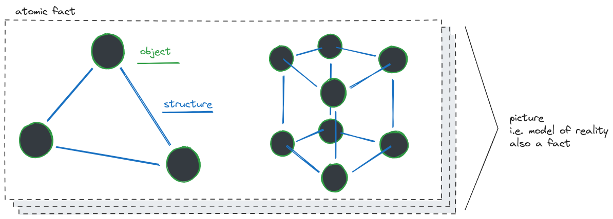

### models of reality

1 The world is everything that is the case.

2.0201 Every statement about complexes can be analyzed into a statement about its constituent parts, and into those propositions which completely describe the complexes.

2.021 Objects form the substance of the world. Therefore they cannot be compound.

> MC: i.e. no dependencies, but "can compose" — the Democritus atom

2.202 The picture represents a possible state of affairs in the logical space.

2.225 There is no picture which is *a priori* true.

> MC: [The Map is Not the Territory](https://www.lesswrong.com/posts/KJ9MFBPwXGwNpadf2/skill-the-map-is-not-the-territory)

3.02 [...] What is thinkable is also possible.

> MC: Was LW a techno-optimist? :)

3.11 We use the perceptible sign (sound or written sign, etc) of the proposition as a projections of the possible state of affairs.

> MC: So we come full-circle. From reality is derived the model, which through language makes it way back into reality.

3.3 Only the proposition has sense; only in the context of a proposition has a name meaning.

### interlude: cruft, bloat, complexity

3.34 A proposition possesses essential and accidental features.
 
Accidental are the features which are due to a particular way of producing the propositional sign. Essential are those which alone enable the proposition to express its sense.

3.341 The essential in a proposition is therefore that which is common to all propositions which can express the same sense.
 
And in the same way in general the essential in a symbol is that which all symbols which can fulfil the same purpose have in common.

> MC: [No Silver Bullet](https://en.wikipedia.org/wiki/No_Silver_Bullet).

### domain models, bounded contexts

4.026 The meanings of the simple signs (the words) must be explained to us, if we are to understand them.
 
But propositions are self-explanatory.

> MC: Code (modules) should be self-explanatory. Classes, objects, variables, not necessarily.
> The whole of a domain — a publicly exposed API — should be of an "intuitive", self-explanatory nature.

4.03 [...] The proposition communicates to us a state of affairs, therefore it must be essentially connected with the state of affairs. [...]

4.06 Propositions can be true or false only by being pictures of the reality.

### logic

5 Propositions are truth-functions of elementary propositions.
 
(An elementary proposition is a truth-function of itself.)

### epistemology

5.551 Our fundamental principle is that **every question which can be decided at all by logic can be decided off-hand**.
 
(And **if we get into a situation where we need to answer such a problem by looking at the world, this shows that we are on a fundamentally wrong track.**)

5.6 **The limits of my language mean the limits of my world.**

> MC: banger 💥

6.13 Logic is not a theory but a reflection of the world.
 
Logic is transcendental.

6.2 Mathematics is a logical method.
 
The propositions of mathematics are equations, and therefore pseudo-propositions.

6.3 Logical research means the investigation of all regularity. And outside logic all is accident.

6.373 The world is independent of my will.

6.421 It is clear that ethics cannot be expressed.
 
Ethics is transcendental.
 
(Ethics and aesthetics are one.)

> MC: we can sense a turn of events coming...

### take a big breath

6.4311 Death is not an event of life. Death is not lived through.
 
If by eternity is understood not endless temporal duration but timelessness, then he lives eternally who lives in the present.
 
Our life is endless in the way that our visual field is without limit.

> MC: WTF. How did we get here?

6.4312 The temporal immortality of the human soul, that is to say, its eternal survival after death, is not only in no way guaranteed, but this assumption in the first place will not do for us what we always tried to make it do. Is a riddle solved by the fact that I survive for ever? Is this eternal life not as enigmatic as our present one? The solution of the riddle of life in space and time lies outside space and time.
 
(It is not problems of natural science which have to be solved.)

> MC: 🤯

6.4321 The facts all belong only to the task and not to its performance.

> MC: 🍄

6.5 For an answer which cannot be expressed the question too cannot be expressed.
 
The riddle does not exist.
 
If a question can be put at all, then it can also be answered.

6.51 [...] For doubt can only exist where there is a question; a question only where there is an answer, and this only where something can be said.

> MC: 🤔

6.52 We feel that **even if all possible scientific questions be answered, the problems of life have still not been touched at all. Of course there is then no question left, and just this is the answer**.

6.521 **The solution of the problem of life is seen in the vanishing of this problem.**
 
(Is not this the reason why men to whom after long doubting the sense of life became clear, could not then say wherein this sense consisted?)

6.522 There is indeed the inexpressible. This shows itself; it is the mystical.

6.53 **The right method of philosophy would be this. To say nothing except what can be said**, i.e. the propositions of natural science, i.e. something that has nothing to do with philosophy: and then always, when someone else wished to say something metaphysical, to demonstrate to him that he had given no meaning to certain signs in his propositions. **This method would be unsatisfying to the other** — he would not have the feeling that we were teaching him philosophy — but it would be the only strictly correct method.

> MC: lol 🤣

6.54 My propositions are elucidatory in this way: he who understands me finally recognizes them as senseless, when he has climbed out through them, on them, over them. (He must so to speak throw away the ladder, after he has climbed up on it.)
 
He must surmount these propositions; then he sees the world rightly.

7 **Whereof one cannot speak, thereof one must be silent.**

> MC: dropping the mic with this one he closes the book
